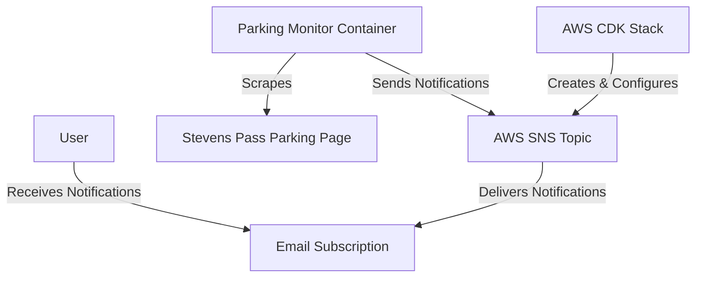

# Parking Monitor

The Parking Monitor is an application designed to notify users when parking becomes available at Stevens Pass. It periodically checks the parking reservation page and sends notifications via AWS SNS when new availability is detected.

## Features

- **Automated Monitoring:** Periodically scrapes the Stevens Pass parking reservation page to check for available spots.
- **AWS SNS Notifications:** Sends alerts to a specified SNS topic when parking becomes available.
- **Daily Reports:** Generates and sends a daily report summarizing parking availability.

## Prerequisites

This setup assumes that AWS credentials are available on the local host in the standard AWS credentials file (`~/.aws/credentials`). If you are unfamiliar with setting up AWS credentials, refer to the [AWS Credentials Documentation](https://docs.aws.amazon.com/cli/latest/userguide/cli-configure-files.html) for guidance.

Before setting up the application, ensure you have the following:

- **AWS Account:** To utilize AWS SNS for notifications.
- **AWS CLI:** Installed and configured with appropriate permissions.
- **Podman/Podman Compose:** To containerize and run the application.

## Architecture Diagram

Below is an overview of the system's architecture:



## Setup Instructions

### 1. Clone the Repository

```bash
git clone https://github.com/mwmisner/parking-monitor.git
cd parking-monitor
```

### 2. AWS SNS Configuration

The application uses AWS SNS to send notifications. You can set up the SNS topic using AWS CDK as follows:

#### Install AWS CDK

```bash
npm install -g aws-cdk
```

#### Navigate to the Infrastructure Directory

```bash
cd infrastructure
```

#### Install Dependencies

```bash
npm install
```

#### Deploy the CDK Stack

```bash
cdk deploy
```

This will create an SNS topic and subscribe your email for notifications. Ensure you confirm the subscription in your email.

#### Retrieve the SNS Topic ARN

After deployment, note down the SNS Topic ARN from the output.

### 3. Configure Your Application

All configuration is now handled through a single JSON file. Simply edit the `config.json` file with your specific settings—including the SNS topic ARN, AWS region, refresh interval, daily report hour, and the list of monitor dates. For example:

```json
{
  "snsTopicArn": "arn:aws:sns:us-east-1:123456789012:MyTopic",
  "region": "us-east-1",
  "interval": 1800000,
  "dailyReportHour": 7,
  "monitorDates": []
}
```

> **Note:** If the `monitorDates` array is left empty, the application will auto-generate dates from tomorrow until three months out.

### 4. Container Configuration and Mounts

The application is containerized and relies on external mounts for both AWS credentials and the configuration file. These mounts are as follows:

- **AWS Credentials:** Mounted from `~/.aws` on your host to `/root/.aws` in the container (read-only).
- **Config File:** Mounted from `./config.json` on your host to `/usr/src/app/config.json` in the container (read-only).

### 5. Running the Application

With your `config.json` properly configured and your AWS credentials available, simply run:

```bash
podman-compose up --build
```

This command builds the container (excluding the `config.json` file via your `.dockerignore`) and mounts your external configuration and AWS credentials into the container at runtime.


## Usage

Once the application is running, it will:

- Periodically check the Stevens Pass parking reservation page for available spots.
- Send an SNS notification when new availability is detected.
- Send a daily report summarizing the parking availability status.

## Contributing

Contributions are welcome! Please fork the repository and submit a pull request for any enhancements or bug fixes.

## License

This project is licensed under the MIT License.

## Acknowledgements

This project utilizes the following technologies:

- **Playwright:** for web scraping.
- **AWS SDK for JavaScript:** for interacting with AWS SNS.
- **AWS CDK:** for infrastructure as code.